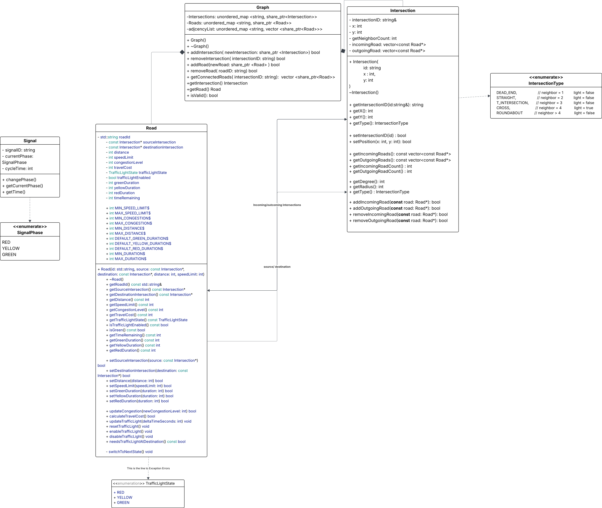

# Urban Traffic Simulator 🚗


## Technologies

* C++
* SDL2
* JSON
* Graph Data Structures
* Object-Oriented Programming
* Design Patterns
* Git & GitHub

---

## Educational Objectives

This project demonstrates:

* Graph modeling of transportation networks
* Dynamic pathfinding algorithms
* Traffic simulation systems
* Event-driven architecture
* Object-Oriented Software Design
* Real-time visualization techniques


---

# ⚙️ Build & Run

## macOS

Install dependencies:

```bash
brew install sdl2 sdl2_image sdl2_ttf
```

Build project:

```bash
make
```

Run:

```bash
make run
```

Clean build:

```bash
make clean
```


---


# Map and Window Design

## Window Layout

The application window is divided into two main sections:

* **Map Viewport** (left side)
* **Control & Statistics Panel** (right side)

Recommended window size:

```text
1600 x 900
```

Layout:

```text
+---------------------------------------------------+------------------+
|                                                   |                  |
|                                                   |                  |
|                                                   |                  |
|                   MAP VIEWPORT                    |  CONTROL PANEL  |
|                                                   |                  |
|                                                   |                  |
|                                                   |                  |
+---------------------------------------------------+------------------+
```

Dimensions:

```text
Map Viewport : 1200 x 900
Control Panel:  400 x 900
```

---

## World Map Size

The world map should be significantly larger than the visible viewport to support camera movement and zooming.

Recommended world size:

```text
4000 x 4000
```

The entire island exists inside this world space.

Example:

```text
World Size    : 4000 x 4000
Viewport Size : 1200 x 900
```

Only a portion of the world is visible at any given time.

---

## Camera System

A camera controls which part of the world is currently visible.


Features:

* Zoom in / Zoom out
* Pan across the island

This allows large maps to be explored while keeping the application window size fixed.

---

## UML Class Diagram

<p align="center">
  
</p>