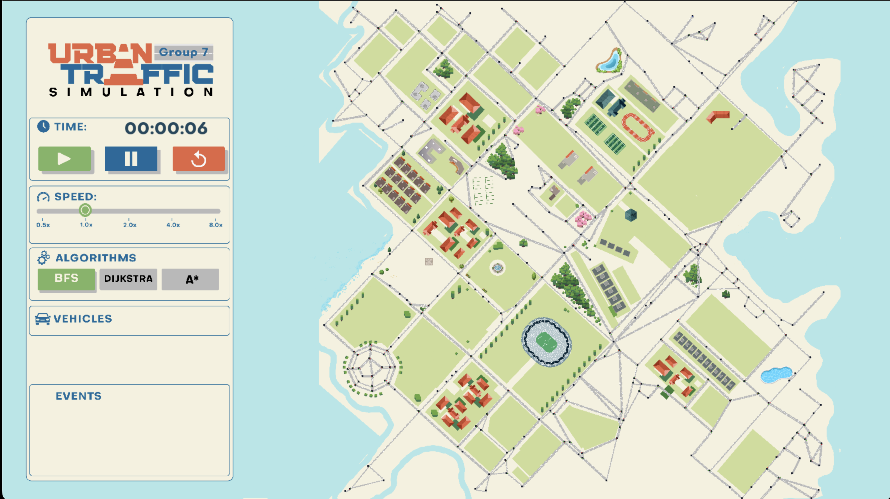

# 🚦 Urban Traffic Simulator

An interactive **Urban Traffic Simulator** developed in **C++** as an Object-Oriented Programming project. The simulator models a modern city's transportation system using graph-based road networks, dynamic vehicle routing, intelligent traffic management, and real-time visualization.

The project demonstrates the application of **Object-Oriented Programming**, **graph algorithms**, **design patterns**, and **software engineering practices** in building a scalable traffic simulation system.

---

# ✨ Project Highlights

* 🚗 Real-time traffic simulation with multiple vehicle types.
* 🗺️ Graph-based road network loaded from configuration files.
* 🔄 Runtime switching between multiple routing algorithms.
* 🚑 Emergency vehicles receive priority by driving along the roadside.
* 📷 Interactive camera with panning and zooming.
* ⚡ Adjustable simulation speed.
* 🎯 Click-to-spawn vehicles at any intersection.
* 🚧 Dynamic traffic events including road closures and congestion.

---


# 🛠️ Technologies

| Category             | Technology   |
| -------------------- | ------------ |
| Programming Language | C++20        |
| Graphics Library     | SDL2         |
| Build System         | CMake        |
| Version Control      | Git & GitHub |
| Project Management   | Jira         |

---

# 📸 Screenshots

<p align="center">
  
</p>

---

## Strategy Pattern

Used for the routing system.

Different pathfinding algorithms can be selected and switched during runtime without modifying the vehicle implementation.

Examples:

* Breadth-First Search (BFS)
* Dijkstra
* A* Search

---

## Factory Pattern

Used for vehicle creation.

The factory is responsible for generating different vehicle types while hiding construction details from the simulation engine.

Supported vehicle types include:

* Car
* Bus
* Emergency Vehicle

---

## Singleton Pattern

The **Singleton Pattern** is applied to the `TrafficLightManager`, ensuring that only one instance exists throughout the simulation.

This centralized manager is responsible for updating and synchronizing all traffic lights, providing a consistent traffic signal system across the entire road network.

---

# 🚗 Features

## Vehicle Simulation

* Multiple vehicle types
* Independent vehicle movement
* Dynamic route planning
* Destination-based navigation
* Random vehicle spawning
* Vehicles stop at red traffic lights
* Vehicles automatically slow down when another vehicle is ahead
* Safe following distance through collision avoidance
* Emergency vehicles can drive along the roadside and maintain their speed

---

## Navigation System

The simulator supports multiple routing algorithms.

Algorithms can be switched during runtime to compare different pathfinding strategies.

Current algorithms include:

* Breadth-First Search (BFS)
* Dijkstra
* A* Search

---

## Traffic Simulation

The simulator models realistic traffic behavior.

Features include:

* Traffic lights
* Vehicle interactions
* Collision avoidance
* Dynamic congestion
* Route recalculation

---

## Dynamic Events

### 🚧 Traffic Congestion

Traffic congestion may occur naturally during the simulation or intentionally by spawning a large number of vehicles.

This allows users to observe how routing algorithms perform under heavy traffic conditions.

---

### 🇺🇸 Presidential Convoy Event

A special event simulates **Donald Trump's presidential convoy** traveling along a predefined route through the city.

During this event:

* The designated route becomes temporarily inaccessible.
* Normal vehicles must avoid the closed roads.
* Traffic conditions dynamically change during the event.

---

## Interactive Controls

Users can interact with the simulation in real time.

* Switch routing algorithms
* Adjust simulation speed
* Spawn vehicles at intersections
* Inspect vehicles and intersections
* Move the camera
* Zoom in / Zoom out

---

# 🖥️ Visualization

The simulator is rendered using **SDL2**.

### Window Configuration

| Property            | Value                     |
| ------------------- | ------------------------- |
| Window Resolution   | **1600 × 900**            |
| Control Panel       | **400 × 900** (Left Side) |
| Simulation Viewport | **1200 × 900**            |
| World Size          | **53000 × 40000**         |

The visualization system supports smooth rendering of a large-scale city map while allowing users to freely explore the environment.

---

# 📂 Project Structure

```text
UrbanTrafficSimulator
│
├── assets/              # Textures, icons and images
├── include/             # Header files
├── src/
│   ├── algorithms/
│   ├── core/
│   ├── factory/
│   ├── graph/
│   ├── simulation/
│   ├── utils/
│   ├── vehicles/
│   └── visualization/
│
├── CMakeLists.txt
└── README.md
```

---

# ⚙️ Installation

## Requirements

* C++20 compatible compiler
* CMake (3.16 or newer)
* SDL2

---

## Windows

### Install Required Software

* Visual Studio 2022 (Desktop development with C++)
* CMake
* SDL2 Development Library

Clone the repository:

```bash
git clone https://github.com/KhanPodMiu/UrbanTrafficSimulator.git
cd UrbanTrafficSimulator
```

Create a build directory:

```bash
mkdir build
cd build
```

Generate project files:

```bash
cmake ..
```

Build the project:

```bash
cmake --build . --config Release
```

Run the executable generated inside the build directory.

---

## macOS

### Install Dependencies

Using Homebrew:

```bash
brew install cmake
brew install sdl2
```

Clone the repository:

```bash
git clone https://github.com/KhanPodMiu/UrbanTrafficSimulator.git
cd UrbanTrafficSimulator
```

Build:

```bash
mkdir build
cd build

cmake ..

cmake --build .
```

Run:

```bash
./UrbanTrafficSimulator
```

---

# 🎮 Usage

Once the simulator starts, users can:

* Explore the city using the camera.
* Zoom in and out.
* Spawn vehicles by clicking intersections.
* Switch routing algorithms.
* Increase simulation speed.
* Observe congestion and traffic events.
* Toggle the live traffic heat map to inspect congestion on every road.

---

## 🎮 Controls

| Key / Mouse | Action |
|-------------|--------|
| W / A / S / D | Move the camera |
| Mouse Drag | Pan the map |
| Mouse Wheel | Zoom in/out |
| Q / E | Zoom out / Zoom in |
| H | Toggle traffic heat map |
| Hover + V | Spawn a vehicle at the selected intersection |
| Left Click | Display information about a vehicle or intersection |

---

### Entity Information Panel

Users can inspect simulation entities interactively.

Selecting a vehicle displays:

- Vehicle ID
- Vehicle type
- Current speed
- Destination
- Current road

Selecting an intersection displays:

- Intersection ID
- Connected roads
- Number of vehicles nearby

---


## UML Class Diagram

📄 **View the UML Class Diagram on Lucidchart:**  
https://lucid.app/lucidchart/621ff6fe-6c69-467e-9886-c0219d5e9a98/edit?invitationId=inv_f5f53f59-8181-4c40-bcf0-7c06040d4c17&page=0_0#
